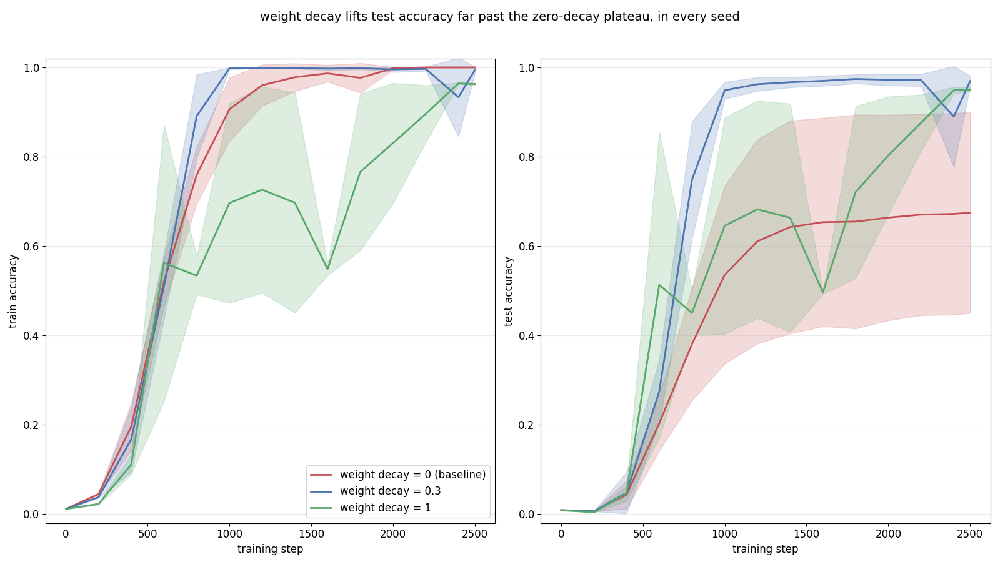

# grokking-replication

> grokking on modular addition from scratch in numpy, measuring whether weight decay sets the delay

## the question

grokking is the pattern where a small transformer's test accuracy jumps from near-chance
to near-perfect long after train accuracy has already settled near its ceiling, and it is
usually attributed to weight decay's regularizing pressure. does that hold up under an
actual zero-decay control, on the same architecture, data, and training budget as every
other run? and if weight decay is what drives it, does the gap between memorizing the
training set and generalizing to the test set shrink as weight decay rises further? that
is the claim under test: grokking on modular addition happens only above some
weight-decay threshold, and above that threshold the memorization-to-generalization delay
gets shorter as weight decay increases.

## what it is measured against

the baseline is the identical model, the identical modular-addition dataset and
train/test split, the identical from-scratch adamw optimizer, and the identical training
budget, with weight decay fixed at zero. a weaker comparison, random-guess accuracy, or a
different architecture entirely, would flatter almost any nonzero-weight-decay run for
free, since the model memorizes the training set well before it does anything interesting
on the held-out set regardless of weight decay. holding everything else fixed and varying
only weight decay is what actually isolates whether weight decay is the variable doing
the work, rather than assuming the literature's account and skipping the control.

## what the numbers say

three weight-decay values (`0.0`, `0.3`, `1.0`), three seeds each, a train/test split
generated once and reused unchanged across every run, training budget shrunk to `2500`
steps so the full sweep fits comfortably under the cpu time limit (`results/rigor.log`,
line 1):

| weight decay | final test accuracy, mean +/- std across seeds | crossed 0.99 train and test |
|---|---|---|
| `0.0` (baseline) | `0.6749` +/- `0.2247` | 0 of 3 seeds |
| `0.3` | `0.9694` +/- `0.0116` | 0 of 3 seeds |
| `1.0` | `0.9654` +/- `0.0217` | 1 of 3 seeds |

(`results/rigor.log`, lines 139, 140, 141)

the part of the claim that held: weight decay measurably helps generalization at this
training budget, for every seed tried. the lowest final test accuracy among the six
nonzero-weight-decay seeds, `0.9458`, still beats the highest final test accuracy among
the three zero-decay seeds, `0.8546`, a clean separation with no overlap
(`results/rigor.log`, lines 19, 35, 41, 57, 73, 89, 105, 121, 137).

the stricter framing, a threshold above which generalization reliably arrives with a
shrinking delay, did not survive multiple seeds as cleanly. an earlier single-seed sweep
at a longer training budget looked exactly like the claim predicts: weight decay `0.0`
and `0.1` never reached `0.99` test accuracy, `0.3` reached it with a `2800`-step gap
behind memorization, and `1.0` reached it with no gap at all (`results/run.log`, lines 136,
137, 138, 139). but once weight decay `1.0` was run at three seeds instead of one,
it stopped looking like a fast, reliable generalizer: only the first seed crosses `0.99`
cleanly at a `600`-step mark, one other seed's test accuracy peaks at `0.9254`, drops back
to `0.4925`, and only then climbs to a final `0.9458` (`results/rigor.log`, lines 81, 83,
89), and the third never crosses `0.99` either despite also ending near `0.9547`
(`results/rigor.log`, line 137). the zero-decay baseline is noisier across seeds too, its
final test accuracy ranging from `0.3581` to `0.8546` depending on seed
(`results/rigor.log`, lines 19, 57, 105), wider than the single `0.3622` figure the first
seed alone suggested at a longer, `6000`-step budget (`results/baseline.log`, line 33).

## running it

- install the pinned dependencies, so the numbers reproduce exactly against the versions
  the logs above were produced with: `pip install -r requirements.txt`.
- run the tests, which cover the dataset split, the hand-derived gradients (checked
  against finite differences), the early-stopping behavior, and, at a smaller scale, the
  direction of the weight-decay effect itself: `pytest tests/`.
- reproduce the zero-decay baseline directly: `python src/train.py`.
- reproduce the single-seed, four-value weight-decay sweep behind `results/run.log`:
  `python src/experiment.py`.
- reproduce the three-seed sweep the table above and the chart below come from, comfortably
  under a ten-minute cpu budget: `python src/rigor.py`.
- regenerate the chart from the committed log: `python src/plot_headline.py`.

```
grokking-replication/
├── src/
│   ├── data.py            modular-addition dataset, tokenizer, and the frozen train/test split
│   ├── model.py            decoder-only transformer, hand-written forward and backward pass
│   ├── train.py             from-scratch adamw training loop with optional early stopping
│   ├── experiment.py    single-seed, four-value weight-decay sweep
│   ├── rigor.py             three-seed, three-value weight-decay sweep
│   └── plot_headline.py  accuracy-vs-training chart, read straight from results/rigor.log
├── tests/                    dataset, gradient, and training-loop tests
└── results/                 the logs every number above is drawn from, plus the chart
```


